## Trendyol Clone

Developed a React-Native e-commerce application with the following features:

- List hundreds of products under various categories on the homepage.
- Add new products to your cart.
- Add products to your favorites.
- Notifications and linking operations have been activated.
- Receive notifications sent by this e-commerce platform.
- Login and logout functionalities.
- Splash screen operations have been performed.
- FireStore has been used as the database.
- The API used for product data is [Fake Store API](https://fakestoreapi.com/docs).
- Coded with **Typscript**
- Utilizes **Async Storage** for local data storage.
- Implements **React-Redux** with **Redux Toolkit** for state management.
- Features a navigation structure for seamless user experience.
- Uses **Axios** for API requests.
- Employs **Formik** for form management and **Yup** for form validation.

### ScreenShots

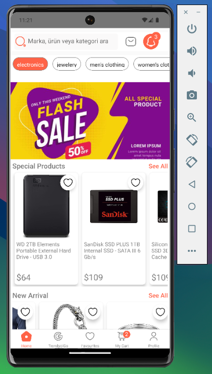

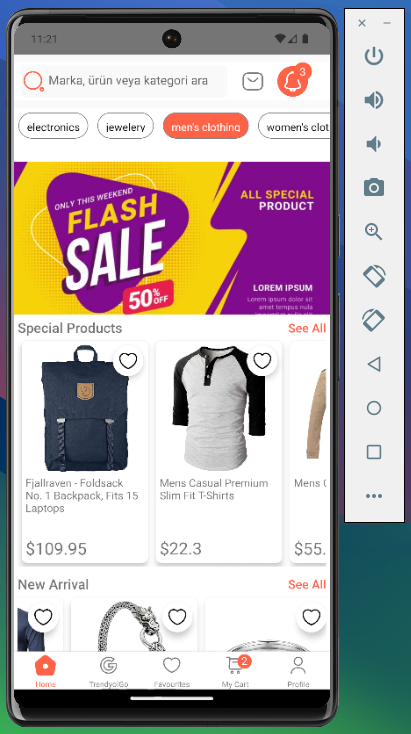

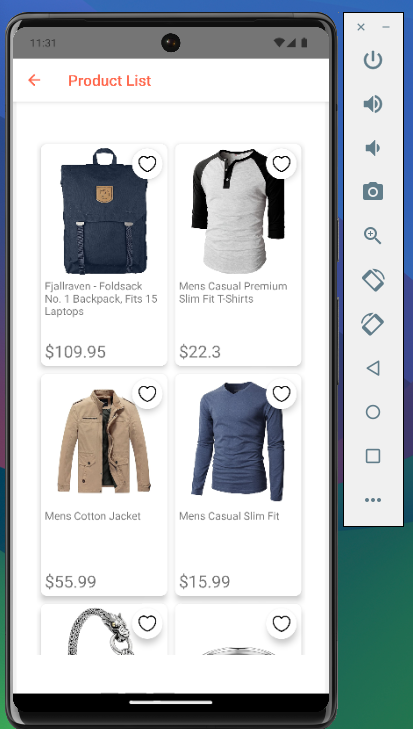

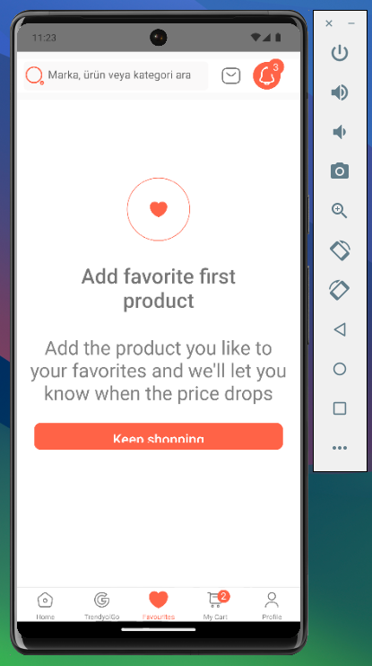

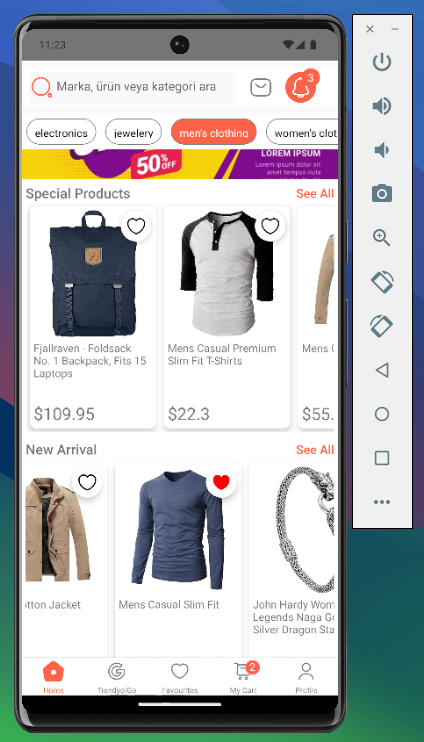

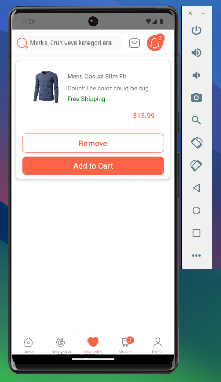

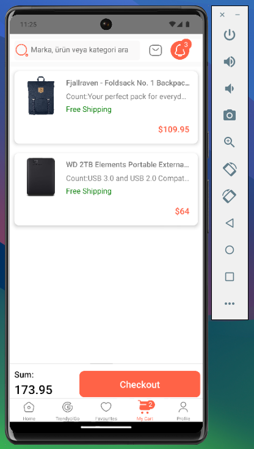

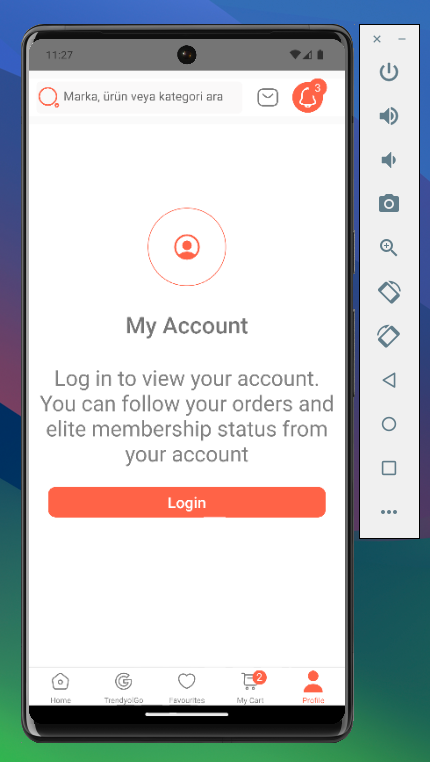

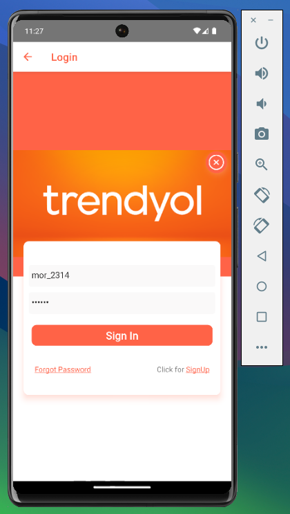

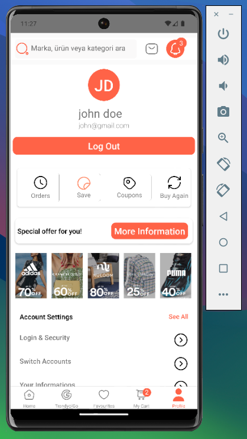

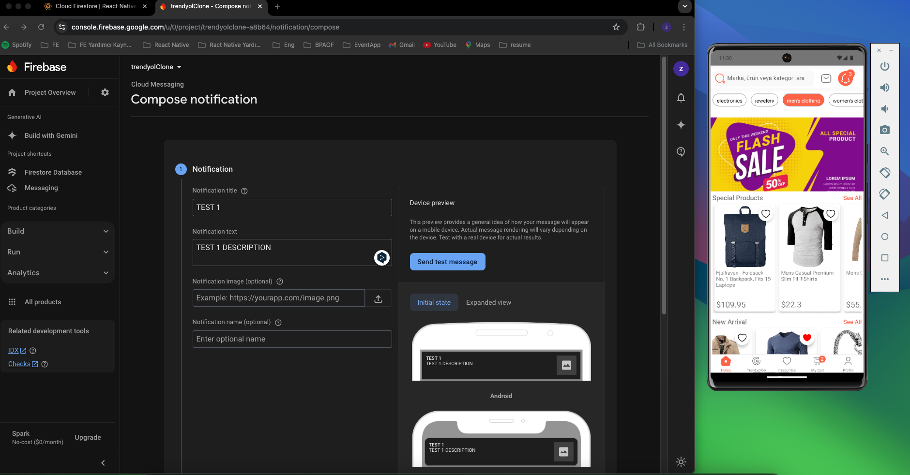

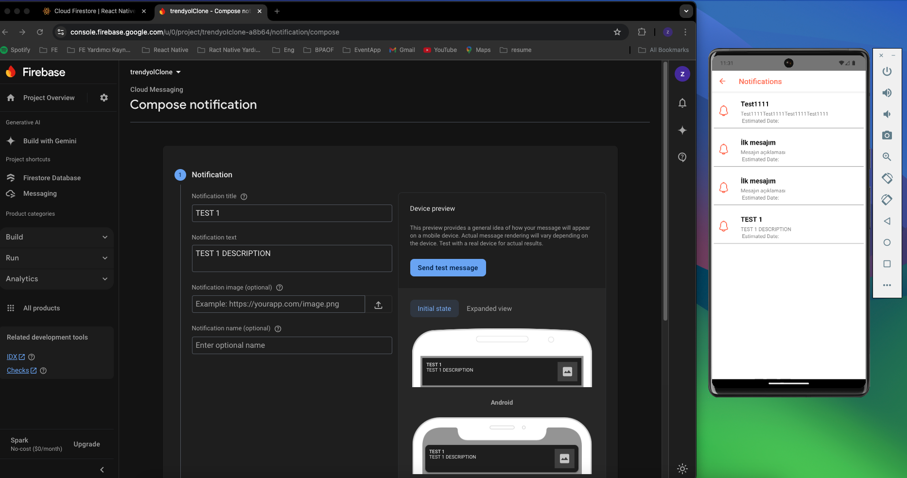
